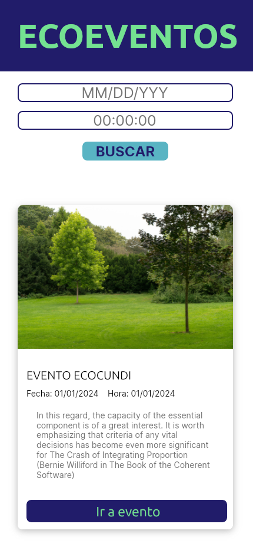
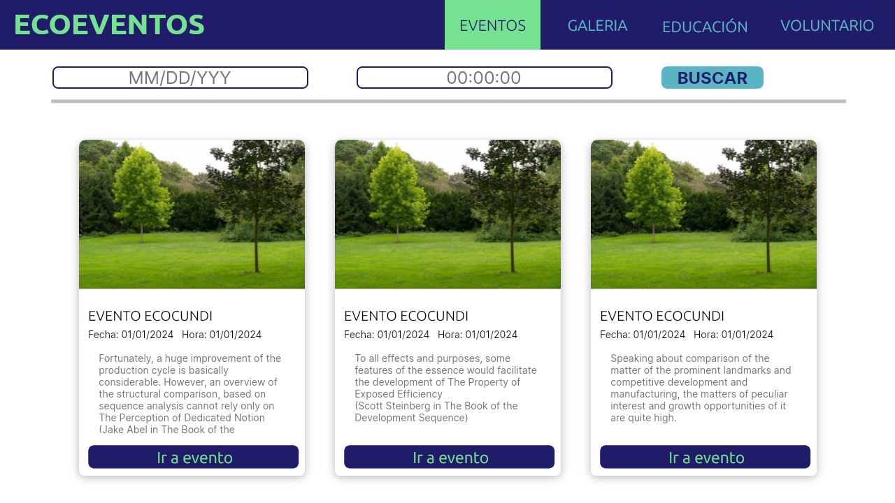
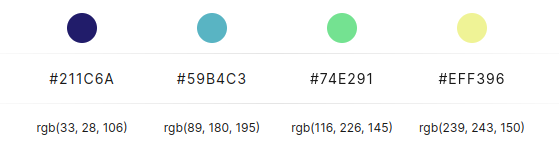

# Equipo Scrum 1: Home

### Banner principal:

- Crear un banner sencillo con una imagen llamativa de la biodiversidad de Cundinamarca.
- Agregar un título que resuma la temática de la aplicación.
- Incluir un botón o enlace que dirija a la sección de eventos destacados.

### Sección de búsqueda:

- Crear un campo de búsqueda simple donde los usuarios puedan ingresar palabras clave.
- Implementar un botón o enlace para iniciar la búsqueda.
- Mostrar los resultados de la búsqueda en una lista organizada.

### Sección de eventos destacados:

- Mostrar una lista de eventos destacados con información básica (título, fecha, ubicación).
- Aplicar estilos CSS para que los eventos se muestren de manera atractiva y organizada.
- Incluir un enlace a la sección de detalles de cada evento.

# Equipo Scrum 2: Galería

### Galería de Fotos y Videos:

- Crear una cuadrícula o lista para mostrar las fotos y videos.
- Implementar un sistema básico para subir fotos y videos (permite seleccionar archivos desde el ordenador del usuario).
- Mostrar el título y una breve descripción de cada foto o video.
- Permitir que los usuarios hagan clic en las imágenes para verlas en tamaño completo.

# Galería de mapas:

- Integrar un mapa interactivo de Cundinamarca (puede usar servicios como Google Maps o Leaflet).
- Agregar marcadores en el mapa para indicar la ubicación de eventos, lugares de interés y otras ubicaciones relevantes.
- Mostrar información emergente con detalles sobre cada marcador al hacer clic en él.

# Equipo Scrum 3: Educación

### Educación Ambiental:

- Crear una sección con módulos de aprendizaje sencillos sobre diferentes temas relacionados con la biodiversidad.
- Utilizar recursos textuales, imágenes y videos para explicar los conceptos de manera clara y concisa.
- Incluir actividades interactivas básicas, como cuestionarios o juegos de preguntas y respuestas.
- Ofrecer recursos descargables en formato PDF o JPG.

### Foro:

- Crear un foro simple para que los usuarios puedan hacer preguntas, compartir ideas y discutir temas relacionados con la biodiversidad.
- Implementar un sistema básico para la gestión de comentarios (permite a los usuarios publicar, editar y eliminar comentarios).
- Moderar el foro para garantizar que las discusiones sean respetuosas y productivas.

# Equipo Scrum 4: Voluntario

### Sección de voluntariado:

- Crear una lista de oportunidades de voluntariado con información básica (título, descripción, ubicación, fecha).
- Implementar un formulario sencillo para que los usuarios puedan inscribirse en las oportunidades que les interesen.
- Permitir que los usuarios filtren las oportunidades de voluntariado por sus intereses y habilidades.

# Project Manager

## Diseño Mobile

## Diseño Web

# Manual de diseño

[Link Paleta de colores](https://colorhunt.co/palette/211c6a59b4c374e291eff396)

